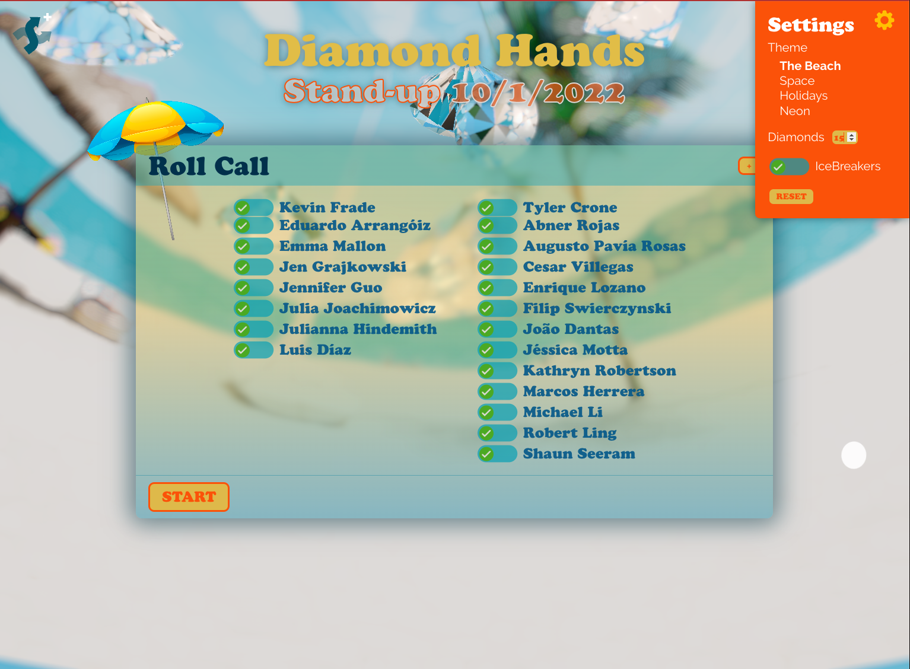

# ShufflerPLUS


ShufflerPLUS is a tool that makes morning Stand-ups fun and highly interactive.

Features:

* Set up the **Roll Call** at the beginning
* State is saved in LocalStorage for **Team Member selections** and **Settings**
* On-deck features next speaker, no more surprises!
* IM Team Lead goes first, then shuffled IM/IC group, then shuffled DEV/QA/CONTENT, then back to DEV Team Lead
* **Blingy** floating diamonds backdrop
* Theme switcher: Beach, Holidays, Space and Neon themes currently available
* Fluid typography
* Ice breaker questions so team can get to know eachother better
* Final inspirational quote

ToDos:

* Automatic **Birthday Theme** enabled on a team member's birthday
* Weather app for each team member to showcase our diverse locales
* ...suggest more features!!


<p align="center">
  
</p>


## Usage

### Installation and Setup

Use the following instuctions to install and run:

<details><summary><b>Show instructions</b></summary>

1. Install the preset:

    ```sh
    $ npm install
    ```

2. Run dev environment:

    ```sh
    $ npm run dev
    ```
</details>