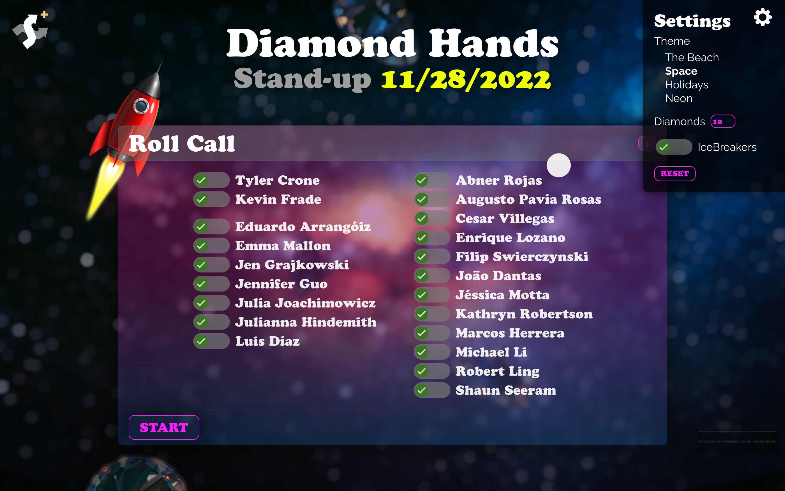

# ShufflerPLUS


For Online Version Visit --> https://shuffler-plus.vercel.app/

ShufflerPLUS is a tool that makes morning Stand-ups fun and highly interactive.

Features:

* Set up the **Roll Call** at the beginning
* State is saved in LocalStorage for **Team Member selections** and **Settings**
* On-deck feature shows next speaker, no more surprises!
* Weather Widget showcases our team members various locales!
* Speaker order -- IM Team Lead goes first, then shuffled IM/IC group, then shuffled DEV/QA/CONTENT, then back to DEV Team Lead
* **Blingy** floating diamonds backdrop
* Theme switcher: Beach, Holidays, Space and Neon themes currently available
* Fluid typography for various viewport widths
* Fun random Ice breaker questions so team can get to know eachother better
* Show random inspirational/funny quote on FINISH

ToDos:

* Make it generic, ability to change squad name + other squad customizations
* Automatic **Birthday Theme** enabled on a team member's birthday
* Default Light and Dark themes based on OS preference
* Mobile tweaks for smaller devices
* Custom theme for every speaker
* <strike>Weather app for each team member to showcase our diverse locales</strike> DONE!
* ...suggest more features!!


<p align="center">
  
  
  
  
</p>


## Usage

### Installation and Setup

Use the following instuctions to install and run:

<details><summary><b>Show instructions</b></summary>

1. Install the preset:

    ```sh
    $ npm install
    ```

2. Run dev environment:

    ```sh
    $ npm run dev
    ```
</details>

### Weather Widget
The Weather widget requires an API Key, FREE from --> https://weatherstack.com/

Creat a .env.local file and and add this line:
VITE_MAP_API_KEY={YOUR API KEY HERE}